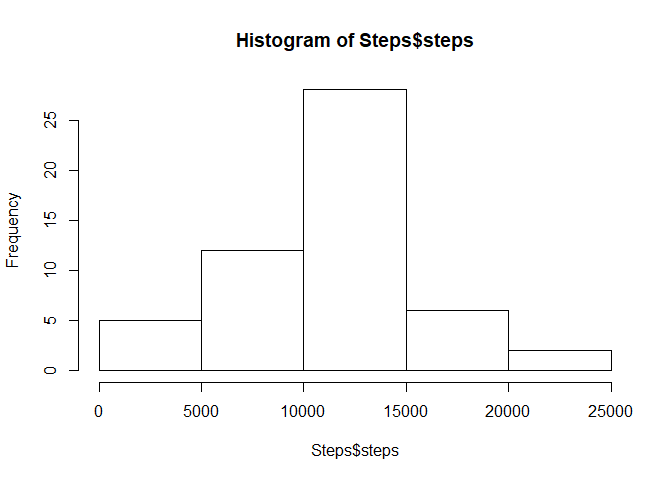
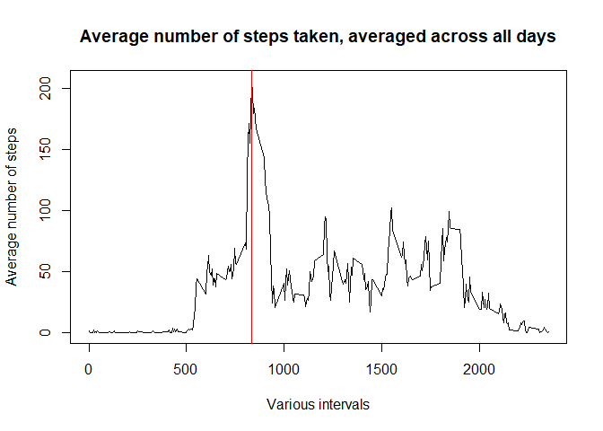
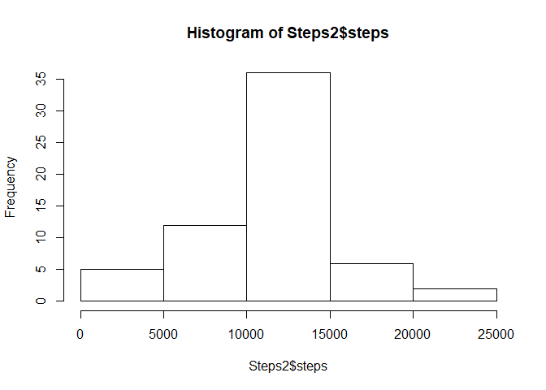

## Loading and preprocessing the data
* Reading the data 

```r
Activity = read.csv("activity.csv", header = TRUE)
```

* Checking out first and last few entries

```r
head(Activity)
```

```
##   steps       date interval
## 1    NA 2012-10-01        0
## 2    NA 2012-10-01        5
## 3    NA 2012-10-01       10
## 4    NA 2012-10-01       15
## 5    NA 2012-10-01       20
## 6    NA 2012-10-01       25
```

```r
tail(Activity)
```

```
##       steps       date interval
## 17563    NA 2012-11-30     2330
## 17564    NA 2012-11-30     2335
## 17565    NA 2012-11-30     2340
## 17566    NA 2012-11-30     2345
## 17567    NA 2012-11-30     2350
## 17568    NA 2012-11-30     2355
```

## What is mean total number of steps taken per day?
* 1. Calculate the total number of steps taken per day

```r
Steps <- aggregate(steps ~ date, Activity, sum, na.rm = TRUE)
#Steps
```

* 2. Make a histogram of the total number of steps taken each day

```r
hist(Steps$steps)
```

<!-- -->

* 3. Calculate and report the mean and median of the total number of steps taken per day

```r
mean(Steps$steps)
```

```
## [1] 10766.19
```

```r
median(Steps$steps)
```

```
## [1] 10765
```

## What is the average daily activity pattern?

```r
Step_Avg_TI <- aggregate(steps ~ interval, Activity, mean, na.rm = TRUE)
#Step_Avg_TI
```

* 1. Make a time series plot (i.e. type = "l") of the 5-minute interval (x-axis) and the average number of steps taken, averaged across all days (y-axis)


```r
n <- nrow(Step_Avg_TI)
Max_interval <- Step_Avg_TI[which.max(Step_Avg_TI$steps),]$interval
plot(Step_Avg_TI$interval, Step_Avg_TI$steps, type = "l", xlab = "Various intervals", ylab = "Average number of steps", main = "Average number of steps taken, averaged across all days")
abline( v = Max_interval, col = "red")
```

<!-- -->

* 2. Which 5-minute interval, on average across all the days in the dataset, contains the maximum number of steps?

```r
Max_interval 
```

```
## [1] 835
```


## Imputing missing values
Note that there are a number of days/intervals where there are missing values (coded as NA). The presence of missing days may introduce bias into some calculations or summaries of the data.

* 1. Calculate and report the total number of missing values in the dataset (i.e. the total number of rows with NAs)

```r
missing_values <- is.na(Activity$steps)
sum(missing_values)
```

```
## [1] 2304
```

* 2. Devise a strategy for filling in all of the missing values in the dataset. The strategy does not need to be sophisticated. For example, you could use the mean/median for that day, or the mean for that 5-minute interval, etc.

I used the strategy of filling Missing values by the mean of the particular interval calulated in previous question. For that created the following funtion


```r
NA2MeanInterval<-function(interval){
    Step_Avg_TI[Step_Avg_TI$interval==interval,]$steps
}
```

* 3. Create a new dataset that is equal to the original dataset but with the missing data filled in.

```r
Activity_Filled <- Activity
count=0
for(i in 1:nrow(Activity_Filled)){
  if(is.na(Activity_Filled[i,]$steps)){
    Activity_Filled[i,]$steps<-NA2MeanInterval(Activity_Filled[i,]$interval)
    count=count+1
  }
}
```

* 4. Make a histogram of the total number of steps taken each day and Calculate and report the mean and median total number of steps taken per day. Do these values differ from the estimates from the first part of the assignment? What is the impact of imputing missing data on the estimates of the total daily number of steps?


```r
cat("Total ",count, "NA values were filled.\n\r")
```

```
## Total  2304 NA values were filled.
## 

```

```r
Steps2<-aggregate(steps~date,data=Activity_Filled,sum)
#Steps2
hist(Steps2$steps)
```

<!-- -->

```r
mean(Steps2$steps)
```

```
## [1] 10766.19
```

```r
median(Steps2$steps)
```

```
## [1] 10766.19
```
The Mean is same in both cases, but there is slight difference in Median values.

## Are there differences in activity patterns between weekdays and weekends?
For this part the weekdays() function may be of some help here. Use the dataset with the filled-in missing values for this part.

* 1. Create a new factor variable in the dataset with two levels – “weekday” and “weekend” indicating whether a given date is a weekday or weekend day.

```r
Activity_Filled$day <- ifelse(as.POSIXlt(as.Date(Activity_Filled$date))$wday%%6==0,
                          "weekend","weekday")
Activity_Filled$day <- factor(Activity_Filled$day,levels=c("weekday","weekend"))
```

* 2. Make a panel plot containing a time series plot (i.e. type = "l") of the 5-minute interval (x-axis) and the average number of steps taken, averaged across all weekday days or weekend days (y-axis). See the README file in the GitHub repository to see an example of what this plot should look like using simulated data.

```r
Step_Avg_TI2 <- aggregate(steps~interval+day,Activity_Filled,mean)
library(lattice)
xyplot(steps~interval|factor(day),data=Step_Avg_TI2,aspect=1/2,type="l")
```

<!-- -->


As depicted by the above graph, there is significant difference between the activity for weekdays and weekends.
